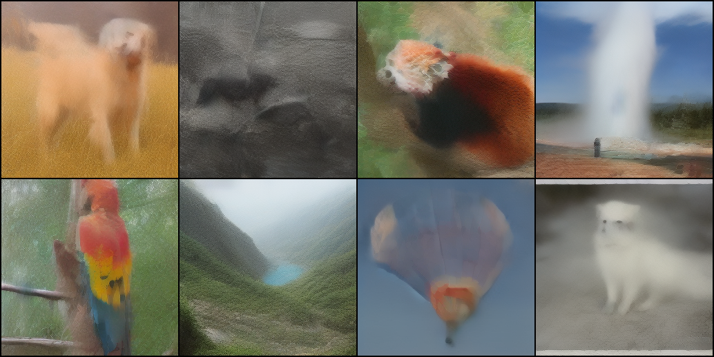
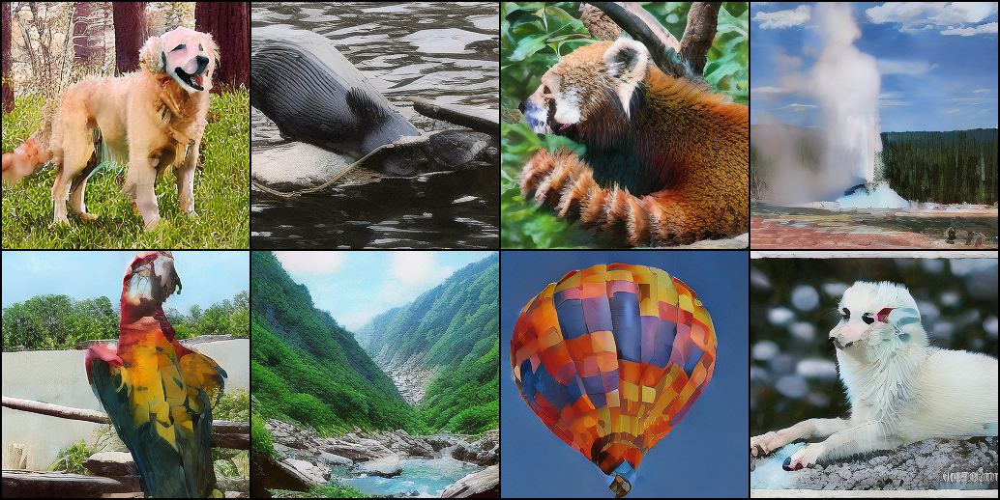

## This project combine DiT and Consistency Models</sub>


DiT samples 50steps

DiT samples 4steps

DiTCM samples 4steps



## Setup

First, download and set up the repo:

```bash
git clone https://github.com/hjmnbnb/DIT_CM.git
cd DIT_CM
```

We provide an [`environment.yml`](environment.yml) file that can be used to create a Conda environment. If you only want 
to run pre-trained models locally on CPU, you can remove the `cudatoolkit` and `pytorch-cuda` requirements from the file.

```bash
conda env create -f environment.yml
conda activate DIT_CM
```

The following refer to the contents of the DiT and fast-DiT project

**Pre-trained DiT checkpoints.** You can sample from our pre-trained DiT models with [`sample.py`](sample.py). Weights for our pre-trained DiT model will be 
automatically downloaded depending on the model you use. The script has various arguments to switch between the 256x256
and 512x512 models, adjust sampling steps, change the classifier-free guidance scale, etc. For example, to sample from
our 512x512 DiT-XL/2 model, you can use:

```bash
python sample.py --image-size 512 --seed 1
```

For convenience, our pre-trained DiT models can be downloaded directly here as well:

| DiT Model     | Image Resolution | FID-50K | Inception Score | Gflops | 
|---------------|------------------|---------|-----------------|--------|
| [XL/2](https://dl.fbaipublicfiles.com/DiT/models/DiT-XL-2-256x256.pt) | 256x256          | 2.27    | 278.24          | 119    |
| [XL/2](https://dl.fbaipublicfiles.com/DiT/models/DiT-XL-2-512x512.pt) | 512x512          | 3.04    | 240.82          | 525    |


**Custom DiT checkpoints.** If you've trained a new DiT model with [`train.py`](train.py) (see [below](#training-dit)), you can add the `--ckpt`
argument to use your own checkpoint instead. For example, to sample from the EMA weights of a custom 
256x256 DiT-L/4 model, run:

```bash
python sample.py --model DiT-L/4 --image-size 256 --ckpt /path/to/model.pt
```


## Training
### Preparation Before Training
To extract ImageNet features with `1` GPUs on one node:

```bash
torchrun --nnodes=1 --nproc_per_node=1 extract_features.py --model DiT-XL/2 --data-path /path/to/imagenet/train --features-path /path/to/store/features
```

### Training DiT
We provide a training script for DiT in [`train.py`](train.py). This script can be used to train class-conditional 
DiT models, but it can be easily modified to support other types of conditioning. 

To launch DiT-XL/2 (256x256) training with `1` GPUs on one node:

```bash
accelerate launch --mixed_precision fp16 train.py --model DiT-XL/2 --features-path /path/to/store/features
```

To launch DiT-XL/2 (256x256) training with `N` GPUs on one node:
```bash
accelerate launch --multi_gpu --num_processes N --mixed_precision fp16 train.py --model DiT-XL/2 --features-path /path/to/store/features
```
### Training DiT_CM
To launch DiT_CM base on DiT-XL/2 with `N` GPUs on one node:
```bash
accelerate launch --main_process_port 56567 --multi_gpu --num_processes 8 --mixed_precision fp16 ditCM_fast.py --model DiT-XL/2 --feature-path /root/wc/fs/data4/ImageNet2012/features --pretrain --lr 1e-6 --num-sampling-steps 100 --results-dir results/0322mutil --global-batch-size 128
```

Alternatively, you have the option to extract and train the scripts located in the folder [training options](train_options).

## Evaluation (FID, Inception Score, etc.)

We include a [`sample_ddp.py`](sample_ddp.py) script which samples a large number of images from a DiT model in parallel. This script 
generates a folder of samples as well as a `.npz` file which can be directly used with [ADM's TensorFlow
evaluation suite](https://github.com/openai/guided-diffusion/tree/main/evaluations) to compute FID, Inception Score and
other metrics. For example, to sample 50K images from our pre-trained DiT-XL/2 model over `N` GPUs, run:

```bash
torchrun --nnodes=1 --nproc_per_node=N sample_ddp.py --model DiT-XL/2 --num-fid-samples 50000
```

There are several additional options; see [`sample_ddp.py`](sample_ddp.py) for details.
